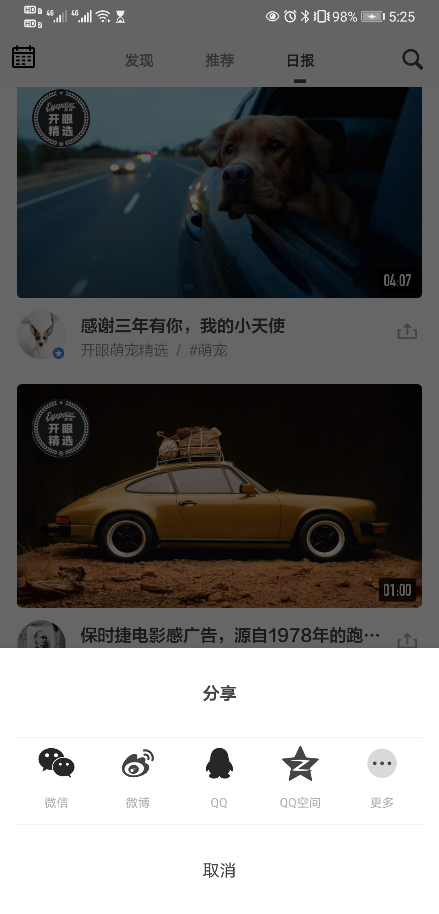
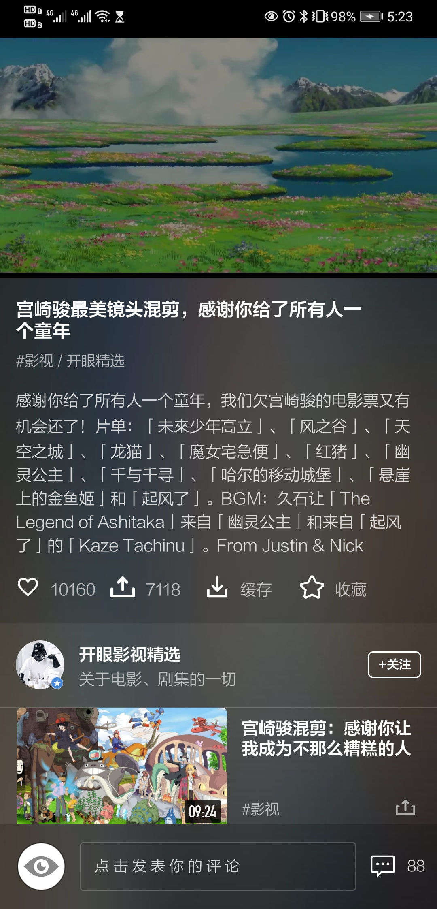
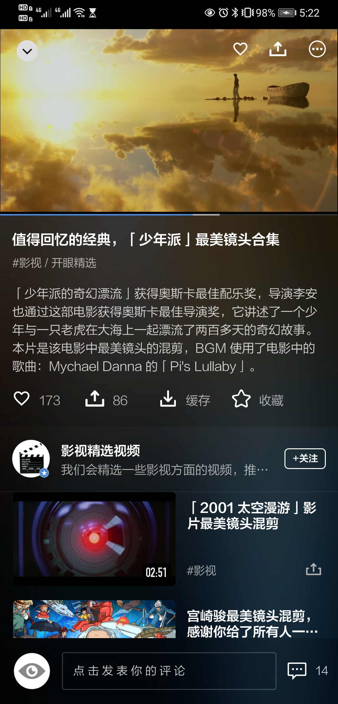
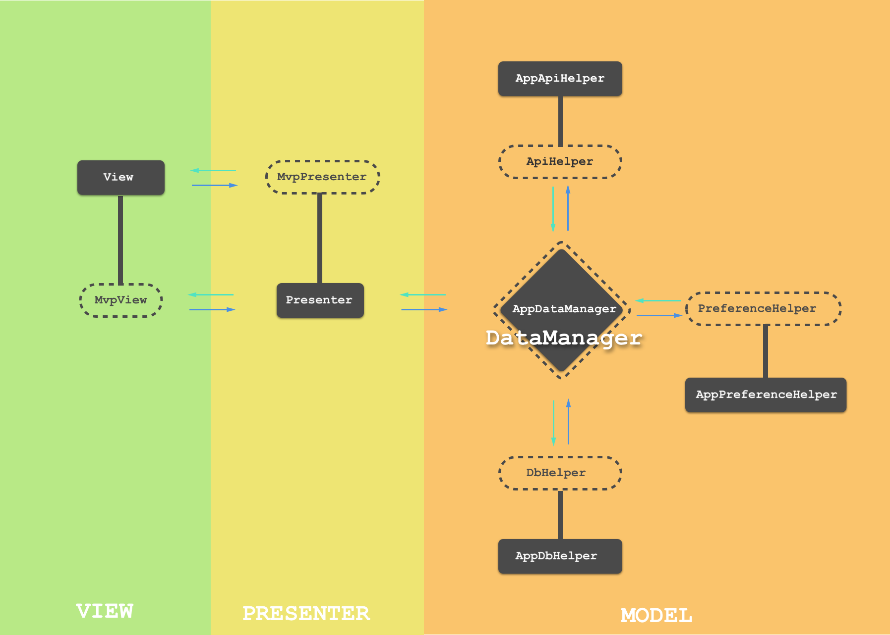
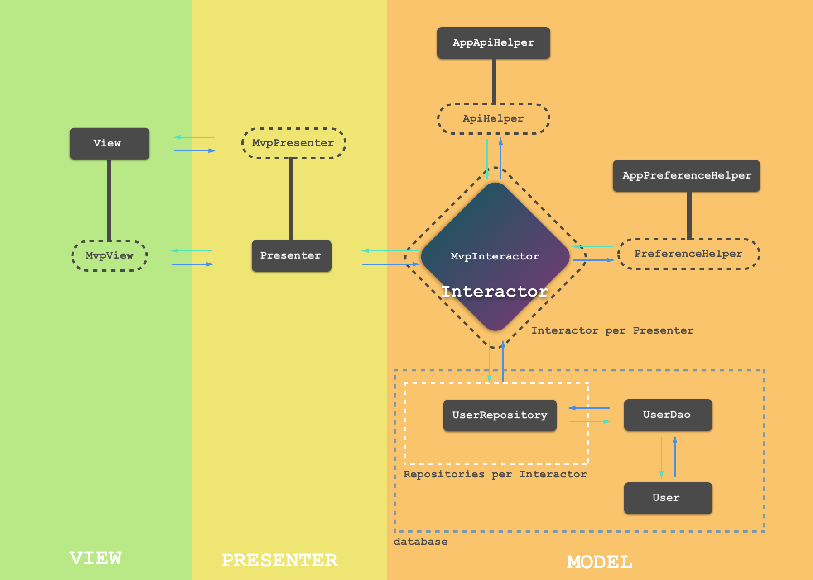
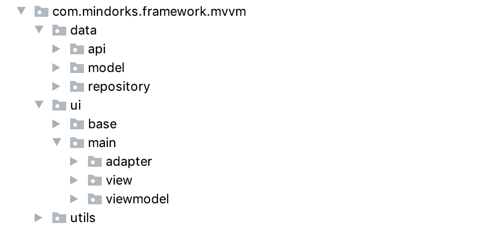
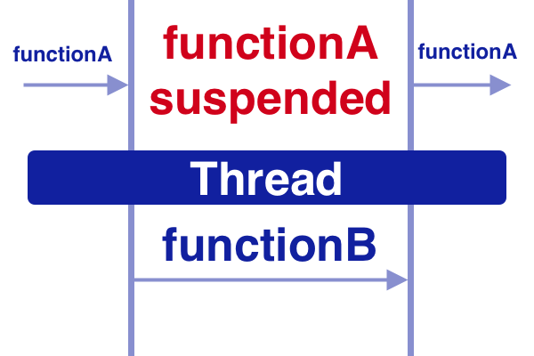

# Eyepertizer

## 0 简介

**仿照[Eyepetizer](https://github.com/VIPyinzhiwei/Eyepetizer)，基于 Kotlin 语言仿写「开眼 Eyepertizer」的一个短视频 Android 客户端项目，主要对一些新的技术、主流框架学习加深印象。**

### 效果图

|  |  |  |
| ------------------------------------------------------------ | :----------------------------------------------------------: | ------------------------------------------------------------ |
|  |  |  |
|  |  |  |

## 1、MVP

### MVP 将应用程序分为三个基本组成部分：

1. **Model**：它负责处理应用程序的数据部分。
2. **View**：它负责在屏幕上用特定的数据铺设视图。
3. **Presenter**：它是连接模型和视图的桥梁。它还充当View的指导者。

### MVP为上述组件制定了一些基本规则，如下所列：

1. View 的唯一责任是按照 Presenter 的指示绘制用户界面。它是应用程序的一个哑巴部分。
2. View 将所有的用户交互委托给它的 Presenter 。
3. View 从不与 Model 直接通信。
4. Presenter 负责将 View 的要求委托给 Model，并指示 View 对特定事件进行操作。
5. Model 负责从服务器、数据库和文件系统获取数据。

### 序言

1. Activity, Fragment, and a CustomView 作为应用程序的 View 部分。
2. 每个 View 都有一个一对一关系的 Presenter。
3. View 通过一个接口与它的 Presenter 进行通信，反之亦然。
4. Model 被分成几个部分。ApiHelper, PreferenceHelper, DatabaseHelper, 和 FileHelper。这些都是DataManager的助手，它实质上是绑定了所有的 Model 部分。
5. Presenter 通过一个接口与 DataManager 进行通信。
6. DataManager 只在被要求时提供服务。
7. Presenter 不能访问 Android 的任何 apis

### 架构图



* **View**：它是应用的一部分，渲染用户界面并接受来自用户的交互。Activity，Fragment 和 CustomView 构成这一部分。
* **MvpView**：它是一个接口，由 View 实现。它通过被暴露的方法和 Presenter 进行通信。
* **Presenter**：它是 View 的决策对应物，是一个纯 Java 类，不能访问 Android 的 API。它接收 View 传递过来的用户交互，然后根据业务逻辑进行决策，最后指示 View 执行特定的动作。它还与 DataManager 进行通信，以获得执行业务逻辑所需的任何数据。
* **MvpPresenter**：它是一个接口，由 Presenter 实现。它暴露方法与 View 进行通信。
* **AppDbHelper**：数据库管理和应用中所有与数据库有关的数据处理都是在这一部分完成。
* **DbHelper**：它是一个由 AppDbHelper 实现的接口，包含了给应用程序调用的方法。该层对 DbHelper 的任何具体实现进行解耦，使 AppDbHelper 成为即插即用的单元。
* **AppPreferenceHelper**：与 AppDbHelper 类型，可以从 SharedPreferences 中读写数据。
* **PreferenceHelper**：与 DbHelper 接口类似，由 AppPreferenceHelper 实现。
* **AppApiHelper**：它负责管理网络 API 调用和 API 数据处理。
* **ApiHelper**：它是一个与DbHelper一样的接口，但由AppApiHelper实现。
* **DataManager**：它是一个由 AppDataManager 实现的接口。它包含所有数据处理操作的方法。理想情况下，它委托所有帮助者类提供的服务。为此，DataManager 接口扩展了DbHelper、PreferenceHelper 和 ApiHelper 接口。
* **AppDataManager**：它是应用程序中任何数据相关操作的一个联系点。DbHelper, PreferenceHelper, 和 ApiHelper 只对 DataManager 起作用。它将所有特定的操作委托给任何 Helper。


### Interactor & Repository

1、对于大型项目，DataManager 和 DbHelper 往往会变得非常大。所有需要对他们进行分散化，DataManager 可以分散化为 Interactor，DbHelper 可以分散化为 Repositories。

* **Interactor**：每个 Presenter 有自己的 Interactor 实例，代替单例的 DataManager。Interactor 的职责与 DataManager 相同，它只关注自己所需的数据访问和调用。
* **Repository**：DbHelper 被分解为 Repositories。例如，用户表的所有数据库查询都是通过 UserRepository 而不是 DbHelper 进行的。UserRepository ，与 DbHelper 类似，通过 UserDao 进行所有相关的查询。一个重要的区别是，Respository 是按需实例化的，每个 Interactor 会得到一个新的 Repository 示例，而不是单例的 DbHelper。



## 2、MVVM

MVVM架构是一个 Model-View-ViewModel 架构，它消除了每个组件之间的紧密耦合。最重要的是，在这个架构中，子代没有对父代的直接引用，他们只有通过观察物的引用。


* **Model**：负责 Android 应用程序的数据和业务逻辑，包括本都和远程数据源、模型类、资源库等。
* **View**：由 UI 代码（Activity，Fragment），XML 组成。它向 ViewModel 发送用户动作，当并不直接获得响应。必须订阅 ViewModel  才能获得相应。
* **ViewModel**：它是 View 和 Model（业务逻辑）之间的一座桥梁，不会对 View 的直接引用，ViewModel 不知道正在与哪个 View 交互。它与 Model 交互，并暴露出可以被 View 观察到的可观察对象。

### 工程结构



[MVVM Architecture - Android Tutorial for Beginners - Step by Step Guide](https://blog.mindorks.com/mvvm-architecture-android-tutorial-for-beginners-step-by-step-guide)

## 3、Dagger2

### 为什么需要依赖注入？

1、依赖注入建立在控制反转的概念之上，一个类应该从外部获得它的依赖关系，任何类不应该直接实例化另一个类，应该从配置类中获取实例。

2、如果一个类通过 **new** 操作符创建了另一个类的实例，那么这个类就不能独立于该类使用和测试，这被称为硬依赖（hard dependency）。

3、从类外提供依赖关系，增加了重复使用类的可能性，并且能够独立于其他类进行测试。

### 注入方式

1. Constructor Injection：注入方法参数
2. Field Injection：注入成员变量（不能是 private）
3. Method Injection：注入方法参数

* **Dependency provider**：用 `@Module` 注解的类负责提供可以被注入的对象。这些类定义了用 `@Provides` 注解的方法。从这些方法返回的对象可用于依赖性注入。
* **Dependency consumer**：`@Inject` 注解用来定义一个依赖关系。
* **Connecting consumer and producer**：一个 `@Component` 注释的接口定义了对象（modules）的 provider 和表达依赖关系的对象之间的连接。这种连接类是由 Dagger 生成的。

### Qualifier & Scop

1、`@Qualifier` 注解用于限定依赖关系。例如，一个类可以同时需要 Application Context 和 Activity Context。这两个对象都是 Context 类型的。Dagger 想要知道提供哪个变量，就需要明确指定他的标识符。因此，`@Qualifier` 被用来区分相同类型但具有不同实例的对象。

2、`@Scope` 同样用于自定义注解，我能可以通过@Scope自定义的注解来限定注解作用域，实现局部的单例；

 ### Component

#### 依赖关系（组件依赖）

AppComponent 持有一个全局的 Context 对象：

```kotlin
@Component(modules = [AppModule::class])
interface AppComponent {
    fun inject(context: Context)
    fun context(): Context
}
```

```kotlin
@Module
class AppModule(private val context: Context) {
    @Provides
    fun provideContext(): Context = context
}
```

ActivityComponent 需要使用 AppComponent 中的 Context 对象：

```kotlin
// 声明了依赖关系
@Component(dependencies = [AppComponent::class], modules = [ActivityModule::class])
interface ActivityComponent {
    fun inject(activity: Activity)
}
```

```kotlin
@Module
class ActivityModule {
    @Provides
    fun provideSp(context: Context) = context.getSharedPreferences("Cooker", Context.MODE_PRIVATE)
}
```

依赖注入：

```kotlin
val appComponent = DaggerAppComponent.builder()
    .appModule(AppModule(this))
    .build()
appComponent.inject(this)

val activityComponent = DaggerActivityComponent.builder().appComponent(appComponent)
    .build()
activityComponent.inject(this)
```

ActivityComponent 声明依赖了 AppComponent，AppComponent 拥有 AppModule 中有可以提供 context 的 Provides，因此 ActivityModule 可以从 AppModule 拿到 context。

#### 包含关系（组件继承）

声明继承需要如下几步：

1. 子 Component 用 `@SubComponent` 注解；
2. 子 Component 声明一个 Builder 来告诉父 Component 如何创建自己；
3. 父 Component 对应的 Module 用 `subcomponent` 属性指明拥有哪些子 Component；
4. 父 Component 声明一个抽象方法来获取子 Component 的 Builder。

```kotlin
// 子 Component 用 @SubComponent 注解
@Subcomponent(modules = [ActivityModule::class])
interface ActivityComponent {

    fun inject(activity: MainActivity)

    // 声明一个 Builder 来告诉父 Component 如何创建自己
    @Subcomponent.Builder
    interface Builder {
        fun build(): ActivityComponent
    }
}
```

```kotlin
// 父 Component 对应的 Module 用 subcomponents 属性指定拥有哪些子 Component
@Module(subcomponents = [ActivityComponent::class])
class AppModule(private val context: Context) {
    @Provides
    fun provideContext(): Context = context
}
```

```kotlin
@Component(modules = [AppModule::class])
interface AppComponent {
    fun inject(context: Context)

    //    fun context(): Context 不再需要

    // 父 Component 声明一个抽象方法来获取子 Component 的 Builder
    fun activityComponent(): ActivityComponent.Builder
}
```

依赖注入：

```kotlin
val appComponent = DaggerAppComponent.builder()
    .appModule(AppModule(this))
    .build()
    appComponent.inject(this)

val activityComponent = appComponent.activityComponent()
    .build()
activityComponent.inject(this)
```

### dagger.android 扩展

1. 在 AppComponent 中安装 AndroidInjectionModule，确保包含四大组件和 Fragment 的注入器类型

```kotlin
@Singleton
@Component(modules = [AndroidInjectionModule::class, ActivityBindModule::class, AppModule::class])
interface AppComponent {
    fun inject(application: EyepertizerApplication)
}
```

2. 在一个抽象 Module 中添加一个使用 `@ContributesAndroidInjector` 注解标记的返回具体的 Activity 类型的抽象方法

```kotlin
@Module
abstract class ActivityBindModule {

    @ContributesAndroidInjector
    abstract fun splashActivityInjector(): SplashActivity

    @ContributesAndroidInjector
    abstract fun mainActivityInjector(): MainActivity
}
```

3. Application 类实现 HasAndroidInjector 接口，并且注入一个 DispatchingAndroidInjector 类型的依赖作为 activityInjector() 方法的返回值。

```kotlin
class EyepertizerApplication : Application(), HasAndroidInjector {

    @Inject
    lateinit var dispatchingActivityInjector: DispatchingAndroidInjector<Any>


    companion object {
        @SuppressLint("StaticFieldLeak")
        lateinit var context: Application
    }

    override fun onCreate() {
        super.onCreate()
        context = this
        val component = DaggerAppComponent.builder().appModule(AppModule(this)).build()
        component.inject(this)

    }

    override fun androidInjector(): AndroidInjector<Any> = dispatchingActivityInjector
}
```

4. 在 onCreate)() 方法中，在 `super.onCreate()` 之前调用 `AndroidInjection.inject(this)`

```kotlin
abstract class BaseActivity : AppCompatActivity(), MvpView {

    override fun onCreate(savedInstanceState: Bundle?) {
        performDI()
        super.onCreate(savedInstanceState)
    }

    private fun performDI() {
        AndroidInjection.inject(this)
    }
}
```

https://johnnyshieh.me/posts/dagger-subcomponent/

https://juejin.cn/post/6844904201219211272

### 4、coroutines

### 什么是协程

**Coroutines = Co + Routines**

**Co** means **cooperation** and **Routines** means **functions.**


Coroutines 的确切定义：一个以更高性能和更简单的方式管理并发的框架，它的轻量级线程是写在实际线程框架之上的，通过利用函数的合作性质来获得最大的好处。

### 为什么需要协程

解决回调嵌套

```kotlin
suspend fun fetchAndShowUser() {
  val user = fetchUser()	// fetch on IO thread
  showUser(user)					// back on UI thread
}
```

```kotlin
suspend fun fetchUser(): User {
  return GlobalScope.async(Dispatchs.IO) {
    // make network call
    // return user
  }.await()
}
```

* **Dispathers**：Dispatchers帮助coroutines决定要在哪个线程上完成工作。**IO**、**Default**、**Main**
* **suspend**：suspend 方法可以启动、暂停和恢复。




suspend 函数只允许从一个coroutine或另一个suspend函数中调用。

在 kotlin 中有两个函数可以启动协程：

* launch{}
* async{}

launch{} 不返回任何东西，而 async{} 返回一个 Deferred<T> 的实例，它有一个 await() 函数来返回 coroutine 的结果，就像我们在Java中的future，我们做future.get()来获取结果。

`launch`

```kotlin
suspend fun fetchUserAndSaveInDatabase() {
  // fetch user from network
  // save user in database
  // and do not returen anything
}
```

```kotlin
GlobalScope.launch(Dispatchers.Main) {
  fetchUserAndSaveInDatabase()	// do on IO thread
}
```

`async`

```kotlin
suspend fun fetchFirstUser(): User {
  // make network call
  // return user
}

suspend fun fetchSecondUser(): User {
  // make network call
  // return user
}
```

```kotlin
GlobalScope.launch(Dispatchers.Main) {
  val userOne = async(Dispatchers.IO) { fetchFirstUser() }
  val userTwo = asynce(Dispatcher.IO) { fetchSecondUser() }
  showUsers(userOne.await(), userTwo.await()) // back on UI thread
}
```

**withContext** 另一种写异步的方式，不必写 await()

```kotlin
suspend fun fetchUser(): User {
  return withContext(Dispatchers.IO) {
    // make network call
    // return user
  }
}
```

```kotlin
GlobalScope.launch(Dispatchers.Main) {
    val userOne = withContext(Dispatchers.IO) { fetchFirstUser() }
    val userTwo = withContext(Dispatchers.IO) { fetchSecondUser() }
    showUsers(userOne, userTwo) // back on UI thread
}
```

当使用`withContext`时，它将串行而不是并行。

### Kotlin Coroutines中的作用域

一旦 Activity 被销毁，后台任务就应该被取消。

```kotlin
class MainActivity : AppCompatActivity(), CoroutineScope {

    lateinit var job: Job

    override fun onCreate(savedInstanceState: Bundle?) {
        super.onCreate(savedInstanceState)
        // create the job
        setContentView(R.layout.activity_main)

        launch {

        }
    }

    override val coroutineContext: CoroutineContext
        get() = Dispatchers.IO + job


    override fun onDestroy() {
        job.cancel()    // cancel the job
        super.onDestroy()
    }
}
```

当需要全局范围，也就是我们的应用程序范围，而不是 Activity 范围时，我们可以使用GlobalScope，如下所示。

```kotlin
GlobalScope.launch(Dispatchers.Main) {
    val userOne = async(Dispatchers.IO) { fetchFirstUser() }
    val userTwo = async(Dispatchers.IO) { fetchSecondUser() }
}
```

### Kotlin Coroutines中的异常处理

**launch**

`try-catch`

```kotlin
GlobalScope.launch(Dispatchers.Main) {
    try {
        fetchUserAndSaveInDatabase() // do on IO thread and back to UI Thread
    } catch (exception: Exception) {
        Log.d(TAG, "$exception handled !")
    }
}
```

`handler`

```kotlin
val handler = CoroutineExceptionHandler { _, exception ->
    Log.d(TAG, "$exception handled !")
}
```

```kotlin
GlobalScope.launch(Dispatchers.Main + handler) {
    fetchUserAndSaveInDatabase() // do on IO thread and back to UI Thread
}
```

**async**

```kotlin
val deferredUser = GlobalScope.async {
    fetchUser()
}
try {
    val user = deferredUser.await()
} catch (exception: Exception) {
    Log.d(TAG, "$exception handled !")
}
```

[Mastering Kotlin Coroutines In Android - Step By Step Guide](https://blog.mindorks.com/mastering-kotlin-coroutines-in-android-step-by-step-guide)

### Android开发中异常处理

```kotlin
launch {
  try {
    val users = getUsers()
    val moreUesrs = getMoreUsers()
  } catch(exception: Exception) {
    println("$exception handled !")
  }
}
```

如果其中一个网络调用失败，它将直接转到 catch 

假设想为失败的网络调用返回一个空列表，但是继续其他网络调用的响应。可以在各个网络调用中加入try-catch块，如下所示：

```kotlin
launch {
  try {
    val user = try {
      getUsers()
    } catch (e: Exception) {
      emptyList<User>()
    }
    val moreUsers = try {
      getMoreUsers()
    } catch (e: Exception) {
      emptyList<User>()
    }
  } catch (exception: Exception) {
    println("$exception handled !")
  }
}
```

并行网络调用：

```kotlin
launch {
    try {
        val usersDeferred = async {  getUsers() }
        val moreUsersDeferred = async { getMoreUsers() }
        val users = usersDeferred.await()
        val moreUsers = moreUsersDeferred.await()
    } catch (exception: Exception) {
        Log.d(TAG, "$exception handled !")
    }
}
```

在这里，我们将面临一个问题，如果任何网络错误出现，应用程序将崩溃！，它不会进入 catch

为了解决这个问题，我们必须像下面那样使用 `coroutineScope`

```kotlin
launch {
    try {
        coroutineScope {
            val usersDeferred = async {  getUsers() }
            val moreUsersDeferred = async { getMoreUsers() }
            val users = usersDeferred.await()
            val moreUsers = moreUsersDeferred.await()
        }
    } catch (exception: Exception) {
        Log.d(TAG, "$exception handled !")
    }
}
```

但是，假设我们想为失败的网络调用返回一个空列表，并继续其他网络调用的响应。我们将不得不使用`supervisorScope`，并像下面那样为各个网络调用添加try-catch块。

```kotlin
launch {
    try {
        supervisorScope {
            val usersDeferred = async { getUsers() }
            val moreUsersDeferred = async { getMoreUsers() }
            val users = try {
                usersDeferred.await()
            } catch (e: Exception) {
                emptyList<User>()
            }
            val moreUsers = try {
                moreUsersDeferred.await()
            } catch (e: Exception) {
                emptyList<User>()
            }
        }
    } catch (exception: Exception) {
        Log.d(TAG, "$exception handled !")
    }
}
```

#### 结论

* 在不使用 `async` 的情况下，我们可以使用 `try-catch` 或 `CoroutineExceptionHandler` 
* 在使用 `asynce` 时，除了 `try-catch` 之外，还可以使用 `coroutineScope` 和 `supervisorScope`
* 对于 `async` ，当你想在一个或一些任务失败时继续执行其他任务时，除了顶层的 `try-catch` 之外，还需要使用 `supervisorScope` 和每个任务的单独 `try-catch `。
* 对于 `async`，当你不想在任何任务失败后继续执行其他任务时，可以使用 `coroutineScope` 和顶级的 `try-catch`。

主要的区别是，只要它的任何一个子任务失败，coroutineScope 就会取消。如果我们想在一个任务失败时继续执行其他任务，我们就用supervisorScope。SupervisorScope不会在其中一个失败时取消其他子任务。


## Todo

- [ ] [Introduction to Room Persistent Library in Android](https://blog.mindorks.com/introduction-to-room-persistent-library-in-android)


- [ ] [Jetpack DataStore Preferences](https://blog.mindorks.com/jetpack-datastore-preferences)

## THANKS

https://github.com/MindorksOpenSource  
https://github.com/VIPyinzhiwei/Eyepetizer

