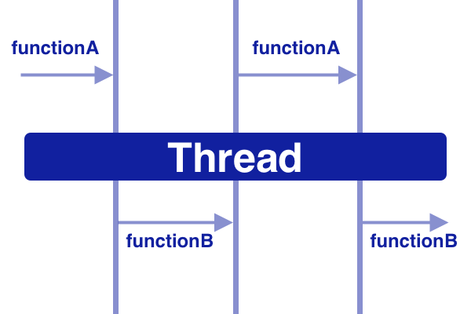

# 协程

### 什么是协程

**Coroutines = Co + Routines**

**Co** means **cooperation** and **Routines** means **functions.**



Coroutines 的确切定义：一个以更高性能和更简单的方式管理并发的框架，它的轻量级线程是写在实际线程框架之上的，通过利用函数的合作性质来获得最大的好处。

### 为什么需要协程

解决回调嵌套

```kotlin
suspend fun fetchAndShowUser() {
  val user = fetchUser()	// fetch on IO thread
  showUser(user)					// back on UI thread
}
```

```kotlin
suspend fun fetchUser(): User {
  return GlobalScope.async(Dispatchs.IO) {
    // make network call
    // return user
  }.await()
}
```

* **Dispathers**：Dispatchers帮助coroutines决定要在哪个线程上完成工作。**IO**、**Default**、**Main**
* **suspend**：suspend 方法可以启动、暂停和恢复。


suspend 函数只允许从一个coroutine或另一个suspend函数中调用。

在 kotlin 中有两个函数可以启动协程：

* launch{}
* async{}

launch{} 不返回任何东西，而 async{} 返回一个 Deferred<T> 的实例，它有一个 await() 函数来返回 coroutine 的结果，就像我们在Java中的future，我们做future.get()来获取结果。

`launch`

```kotlin
suspend fun fetchUserAndSaveInDatabase() {
  // fetch user from network
  // save user in database
  // and do not returen anything
}
```

```kotlin
GlobalScope.launch(Dispatchers.Main) {
  fetchUserAndSaveInDatabase()	// do on IO thread
}
```

`async`

```kotlin
suspend fun fetchFirstUser(): User {
  // make network call
  // return user
}

suspend fun fetchSecondUser(): User {
  // make network call
  // return user
}
```

```kotlin
GlobalScope.launch(Dispatchers.Main) {
  val userOne = async(Dispatchers.IO) { fetchFirstUser() }
  val userTwo = asynce(Dispatcher.IO) { fetchSecondUser() }
  showUsers(userOne.await(), userTwo.await()) // back on UI thread
}
```

**withContext** 另一种写异步的方式，不必写 await()

```kotlin
suspend fun fetchUser(): User {
  return withContext(Dispatchers.IO) {
    // make network call
    // return user
  }
}
```

```kotlin
GlobalScope.launch(Dispatchers.Main) {
    val userOne = withContext(Dispatchers.IO) { fetchFirstUser() }
    val userTwo = withContext(Dispatchers.IO) { fetchSecondUser() }
    showUsers(userOne, userTwo) // back on UI thread
}
```

当使用`withContext`时，它将串行而不是并行。

### Kotlin Coroutines中的作用域

一旦 Activity 被销毁，后台任务就应该被取消。

```kotlin
class MainActivity : AppCompatActivity(), CoroutineScope {

    lateinit var job: Job

    override fun onCreate(savedInstanceState: Bundle?) {
        super.onCreate(savedInstanceState)
        // create the job
        setContentView(R.layout.activity_main)

        launch {

        }
    }

    override val coroutineContext: CoroutineContext
        get() = Dispatchers.IO + job


    override fun onDestroy() {
        job.cancel()    // cancel the job
        super.onDestroy()
    }
}
```

当需要全局范围，也就是我们的应用程序范围，而不是 Activity 范围时，我们可以使用GlobalScope，如下所示。

```kotlin
GlobalScope.launch(Dispatchers.Main) {
    val userOne = async(Dispatchers.IO) { fetchFirstUser() }
    val userTwo = async(Dispatchers.IO) { fetchSecondUser() }
}
```

### Kotlin Coroutines中的异常处理

**launch**

`try-catch`

```kotlin
GlobalScope.launch(Dispatchers.Main) {
    try {
        fetchUserAndSaveInDatabase() // do on IO thread and back to UI Thread
    } catch (exception: Exception) {
        Log.d(TAG, "$exception handled !")
    }
}
```

`handler`

```kotlin
val handler = CoroutineExceptionHandler { _, exception ->
    Log.d(TAG, "$exception handled !")
}
```

```kotlin
GlobalScope.launch(Dispatchers.Main + handler) {
    fetchUserAndSaveInDatabase() // do on IO thread and back to UI Thread
}
```

**async**

```kotlin
val deferredUser = GlobalScope.async {
    fetchUser()
}
try {
    val user = deferredUser.await()
} catch (exception: Exception) {
    Log.d(TAG, "$exception handled !")
}
```

[Mastering Kotlin Coroutines In Android - Step By Step Guide](https://blog.mindorks.com/mastering-kotlin-coroutines-in-android-step-by-step-guide)

### Android开发中异常处理

```kotlin
launch {
  try {
    val users = getUsers()
    val moreUesrs = getMoreUsers()
  } catch(exception: Exception) {
    println("$exception handled !")
  }
}
```

如果其中一个网络调用失败，它将直接转到 catch 

假设想为失败的网络调用返回一个空列表，但是继续其他网络调用的响应。可以在各个网络调用中加入try-catch块，如下所示：

```kotlin
launch {
  try {
    val user = try {
      getUsers()
    } catch (e: Exception) {
      emptyList<User>()
    }
    val moreUsers = try {
      getMoreUsers()
    } catch (e: Exception) {
      emptyList<User>()
    }
  } catch (exception: Exception) {
    println("$exception handled !")
  }
}
```

并行网络调用：

```kotlin
launch {
    try {
        val usersDeferred = async {  getUsers() }
        val moreUsersDeferred = async { getMoreUsers() }
        val users = usersDeferred.await()
        val moreUsers = moreUsersDeferred.await()
    } catch (exception: Exception) {
        Log.d(TAG, "$exception handled !")
    }
}
```

在这里，我们将面临一个问题，如果任何网络错误出现，应用程序将崩溃！，它不会进入 catch

为了解决这个问题，我们必须像下面那样使用 `coroutineScope`

```kotlin
launch {
    try {
        coroutineScope {
            val usersDeferred = async {  getUsers() }
            val moreUsersDeferred = async { getMoreUsers() }
            val users = usersDeferred.await()
            val moreUsers = moreUsersDeferred.await()
        }
    } catch (exception: Exception) {
        Log.d(TAG, "$exception handled !")
    }
}
```

但是，假设我们想为失败的网络调用返回一个空列表，并继续其他网络调用的响应。我们将不得不使用`supervisorScope`，并像下面那样为各个网络调用添加try-catch块。

```kotlin
launch {
    try {
        supervisorScope {
            val usersDeferred = async { getUsers() }
            val moreUsersDeferred = async { getMoreUsers() }
            val users = try {
                usersDeferred.await()
            } catch (e: Exception) {
                emptyList<User>()
            }
            val moreUsers = try {
                moreUsersDeferred.await()
            } catch (e: Exception) {
                emptyList<User>()
            }
        }
    } catch (exception: Exception) {
        Log.d(TAG, "$exception handled !")
    }
}
```

#### 结论

* 在不使用 `async` 的情况下，我们可以使用 `try-catch` 或 `CoroutineExceptionHandler` 
* 在使用 `asynce` 时，除了 `try-catch` 之外，还可以使用 `coroutineScope` 和 `supervisorScope`
* 对于 `async` ，当你想在一个或一些任务失败时继续执行其他任务时，除了顶层的 `try-catch` 之外，还需要使用 `supervisorScope` 和每个任务的单独 `try-catch `。
* 对于 `async`，当你不想在任何任务失败后继续执行其他任务时，可以使用 `coroutineScope` 和顶级的 `try-catch`。

主要的区别是，只要它的任何一个子任务失败，coroutineScope 就会取消。如果我们想在一个任务失败时继续执行其他任务，我们就用supervisorScope。SupervisorScope不会在其中一个失败时取消其他子任务。


