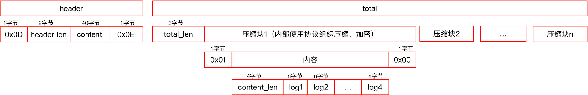
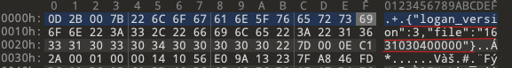
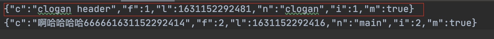

# Logan

### 简介

**1、整体结构**


1. 当有日志(data)需要写入时，将data做系列处理：格式化(附加线程、时间等有用信息)、压缩、DES加密，最后追加到 mmap 中。
2. mmap 能提高写日志效率，防止丢失，mmap 中，如果日志达到了 5 K，就构成一个压缩单元，如果有后续的日志，就开始一个新的压缩单元。
3. 当 mmap 中的日志超过容量(初始指定为10M)的1/3就写入日志文件中。

**2、存储结构**





1. 日志头以 0x0D标志位表示header开始，紧接两个字节表示头内容的长度，接着是头内容、最后用 0x0E 标志位表示 header 结束。
2. 日志体由长度(total_len，三字节、小端模式存储)、协议组成。协议由协议起始标志位(1字节，值为0x01)、内容、协议结束标志位(1字节、值为0x00)。内容由内容长度(4字节，大端模式存储)、各个log组成。

### Java 部分

**1、初始化**

```java
LoganConfig config = new LoganConfig.Builder()
                .setCachePath(getApplicationContext().getFilesDi r().getAbsolutePath())
                .setPath(getApplicationContext().getExternalFilesDir(null).getAbsolutePath() + File.separator + FILE_NAME)
                .setEncryptKey16("0123456789012345".getBytes())
                .setEncryptIV16("0123456789012345".getBytes())
                .build();
```

**LoganConfig**

```java
    String mCachePath; //mmap缓存路径
    String mPathPath; //file文件路径

    long mMaxFile = DEFAULT_FILE_SIZE; //删除文件最大值，默认 10 M
    long mDay = DEFAULT_DAY; //删除天数，默认 10 天
    long mMaxQueue = DEFAULT_QUEUE;
    long mMinSDCard = DEFAULT_MIN_SDCARD_SIZE; //最小sdk卡大小

    byte[] mEncryptKey16; //128位aes加密Key
    byte[] mEncryptIv16; //128位aes加密IV
```

**LoganControlCenter**：Logan 功能真正实现的地方

```java
Logan.init(config) => LoganControlCenter.instance(loganConfig) => LoganControlCenter.init()
```

*LoganControlCenter#init()*

```java
    private void init() {
        if (mLoganThread == null) {
            mLoganThread = new LoganThread(mCacheLogQueue, mCachePath, mPath, mSaveTime,
                    mMaxLogFile, mMinSDCard, mEncryptKey16, mEncryptIv16);
            mLoganThread.setName("logan-thread");
            mLoganThread.start();
        }
    }
```

启动一个 LoganThread 线程，命名为 Logan-thread，构建生产者消费者模式来处理写入的数据，使用 ConcurrentLinkedQueue 实现队列

*LoganThread#run*

```java
    public void run() {
        super.run();
        while (mIsRun) {
            synchronized (sync) {
                mIsWorking = true;
                try {
                    LoganModel model = mCacheLogQueue.poll();
                    if (model == null) {
                        mIsWorking = false;
                        sync.wait();
                        mIsWorking = true;
                    } else {
                        action(model);
                    }
                } catch (InterruptedException e) {
                    e.printStackTrace();
                    mIsWorking = false;
                }
            }
        }
    }
```

* 一开始，mCacheLogQueue 没有数据，会调用 `sync.wait()` 线程进入 **WAITING** 状态，等待数据写入操作。

**2、写数据**

```java
/**
     * @param log  表示日志内容
     * @param type 表示日志类型: log, anr, crash
     */
    public static void w(String log, int type) {
        if (sLoganControlCenter == null) {
            throw new RuntimeException("Please initialize Logan first");
        }
        sLoganControlCenter.write(log, type);
    }
```

```java
Logan.w("logan init success", LOG);
```

*LoganControlCenter#write(String log, int flag)*

```java
    void write(String log, int flag) {
        if (TextUtils.isEmpty(log)) {
            return;
        }
        LoganModel model = new LoganModel();
        model.action = LoganModel.Action.WRITE;
        WriteAction action = new WriteAction();
        String threadName = Thread.currentThread().getName();
        long threadLog = Thread.currentThread().getId();
        boolean isMain = false;
        if (Looper.getMainLooper() == Looper.myLooper()) {
            isMain = true;
        }
        action.log = log;
        action.localTime = System.currentTimeMillis();
        action.flag = flag;
        action.isMainThread = isMain;
        action.threadId = threadLog;
        action.threadName = threadName;
        model.writeAction = action;
        if (mCacheLogQueue.size() < mMaxQueue) {
            mCacheLogQueue.add(model);
            if (mLoganThread != null) {
                mLoganThread.notifyRun();
            }
        }
    }
```

* 如果 mCacheLogQueue 的数量小于 mMaxQueue（默认500），则加入到 mCacheLogQueue 中，然后调用 mLoganThread.notifyRun()，通知 LoganThread 处理数据。

*LoganThread#action(LoganModel model)*

```java
private void action(LoganModel model) {
    if (model == null || !model.isValid()) {
        return;
    }
    if (mLoganProtocol == null) {
        mLoganProtocol = LoganProtocol.newInstance();
        mLoganProtocol.setOnLoganProtocolStatus(new OnLoganProtocolStatus() {
            @Override
            public void loganProtocolStatus(String cmd, int code) {
                Logan.onListenerLogWriteStatus(cmd, code);
            }
        });
        mLoganProtocol.logan_init(mCachePath, mPath, (int) mMaxLogFile, mEncryptKey16,
                mEncryptIv16);
        mLoganProtocol.logan_debug(Logan.sDebug);
    }

    if (model.action == LoganModel.Action.WRITE) {
        doWriteLog2File(model.writeAction);
    } else if (model.action == LoganModel.Action.SEND) {
        if (model.sendAction.sendLogRunnable != null) {
            // 是否正在发送
            synchronized (sendSync) {
                if (mSendLogStatusCode == SendLogRunnable.SENDING) {
                    mCacheSendQueue.add(model);
                } else {
                    doSendLog2Net(model.sendAction);
                }
            }
        }
    } else if (model.action == LoganModel.Action.FLUSH) {
        doFlushLog2File();
    }
}
```

* 如果 LoganProtocol 还没初始化，则先初始化

*LoganProtocol#Logan_init(String cache_path, String dir_path, int max_file, String encrypt_key_16,String encrypt_iv_16)*

```java
    @Override
    public void logan_init(String cache_path, String dir_path, int max_file, String encrypt_key_16,
                           String encrypt_iv_16) {
        Log.d("LoganProtocol", "thread name: " + Thread.currentThread().getName());
        if (mIsInit) {
            return;
        }
        if (CLoganProtocol.isCloganSuccess()) {
            mCurProtocol = CLoganProtocol.newInstance();
            mCurProtocol.setOnLoganProtocolStatus(mLoganProtocolStatus);
            mCurProtocol.logan_init(cache_path, dir_path, max_file, encrypt_key_16, encrypt_iv_16);
            mIsInit = true;
        } else {
            mCurProtocol = null;
        }
    }
```

`CLoganProtocol` 是连接 Java 和 native 的桥梁，后面再详细解析。

*LoganThread#doWriteLog2File(WriteAction action)*

```java
    private void doWriteLog2File(WriteAction action) {
        if (Logan.sDebug) {
            Log.d(TAG, "Logan write start");
        }
        if (mFileDirectory == null) {
            mFileDirectory = new File(mPath);
        }

        if (!isDay()) {
            long tempCurrentDay = Util.getCurrentTime();
            //save时间
            long deleteTime = tempCurrentDay - mSaveTime;
            deleteExpiredFile(deleteTime);
            mCurrentDay = tempCurrentDay;
            mLoganProtocol.logan_open(String.valueOf(mCurrentDay));
        }

        long currentTime = System.currentTimeMillis(); //每隔1分钟判断一次
        if (currentTime - mLastTime > MINUTE) {
            mIsSDCard = isCanWriteSDCard();
        }
        mLastTime = System.currentTimeMillis();

        if (!mIsSDCard) { //如果大于50M 不让再次写入
            return;
        }
        mLoganProtocol.logan_write(action.flag, action.log, action.localTime, action.threadName,
                action.threadId, action.isMainThread);
    }
```

* 首次调用时，isDay() 为 false，（是否是一天之内)，会删除过期的文件，然后调用 `mLoganProtocol.logan_open(file)` 打开当天的文件；

* 每隔一分钟，会判断所有的日志文件是否超过设置的文件大小，如果超过了就不再写入。

* 最后调用 `mLoganProtocol.logan_write()` 写入日志内容。

**3、flush 数据**

```java
Logan.f();
```

*LoganControlCenter#flush()*

```java
    void flush() {
        if (TextUtils.isEmpty(mPath)) {
            return;
        }
        LoganModel model = new LoganModel();
        model.action = LoganModel.Action.FLUSH;
        mCacheLogQueue.add(model);
        if (mLoganThread != null) {
            mLoganThread.notifyRun();
        }
    }
```

*LoganControlCenter#doFlushLog2File()*

```java
    private void doFlushLog2File() {
        if (Logan.sDebug) {
            Log.d(TAG, "Logan flush start");
        }
        if (mLoganProtocol != null) {
            mLoganProtocol.logan_flush();
        }
    }
```

* 最终会调用 native `clogan_flush` 方法。

**4、发送数据**

*LoganControlCenter#send(String dates[], SendLogRunnable runnable)* 发送数据请求

```java
    void send(String dates[], SendLogRunnable runnable) {
        if (TextUtils.isEmpty(mPath) || dates == null || dates.length == 0) {
            return;
        }
        for (String date : dates) {
            if (TextUtils.isEmpty(date)) {
                continue;
            }
            long time = getDateTime(date);
            if (time > 0) {
                LoganModel model = new LoganModel();
                SendAction action = new SendAction();
                model.action = LoganModel.Action.SEND;
                action.date = String.valueOf(time);
                action.sendLogRunnable = runnable;
                model.sendAction = action;
                mCacheLogQueue.add(model);
                if (mLoganThread != null) {
                    mLoganThread.notifyRun();
                }
            }
        }
    }
```

*LoganThread#doSendLog2Net(SendAction action)*

```java
    private void doSendLog2Net(SendAction action) {
        if (Logan.sDebug) {
            Log.d(TAG, "Logan send start");
        }
        if (TextUtils.isEmpty(mPath) || action == null || !action.isValid()) {
            return;
        }
        boolean success = prepareLogFile(action);
        if (!success) {
            if (Logan.sDebug) {
                Log.d(TAG, "Logan prepare log file failed, can't find log file");
            }
            return;
        }
        action.sendLogRunnable.setSendAction(action);
        action.sendLogRunnable.setCallBackListener(
                new SendLogRunnable.OnSendLogCallBackListener() {
                    @Override
                    public void onCallBack(int statusCode) {
                        synchronized (sendSync) {
                            mSendLogStatusCode = statusCode;
                            if (statusCode == SendLogRunnable.FINISH) {
                                mCacheLogQueue.addAll(mCacheSendQueue);
                                mCacheSendQueue.clear();
                                notifyRun();
                            }
                        }
                    }
                });
        mSendLogStatusCode = SendLogRunnable.SENDING;
        if (mSingleThreadExecutor == null) {
            mSingleThreadExecutor = Executors.newSingleThreadExecutor(new ThreadFactory() {
                @Override
                public Thread newThread(Runnable r) {
                    // Just rename Thread
                    Thread t = new Thread(Thread.currentThread().getThreadGroup(), r,
                            "logan-thread-send-log", 0);
                    if (t.isDaemon()) {
                        t.setDaemon(false);
                    }
                    if (t.getPriority() != Thread.NORM_PRIORITY) {
                        t.setPriority(Thread.NORM_PRIORITY);
                    }
                    return t;
                }
            });
        }
        mSingleThreadExecutor.execute(action.sendLogRunnable);
    }
```

* 如果当前正在发送数据，则将任务添加到 `mCacheSendQueue` 等待下一下执行发送任务。
* 发送完成之后，会将 `mCacheSendQueue` 中的任务添加到 `mCacheLogQueue` ，等待下一次执行。

*LoganThread#prepareLogFile(SendAction action)*

```java
    /**
     * 发送日志前的预处理操作
     */
    private boolean prepareLogFile(SendAction action) {
        if (Logan.sDebug) {
            Log.d(TAG, "prepare log file");
        }
        if (isFile(action.date)) { //是否有日期文件
            String src = mPath + File.separator + action.date;
            // 如果上传的当天的日志，则生成一个副本
            if (action.date.equals(String.valueOf(Util.getCurrentTime()))) {
                doFlushLog2File();
                String des = mPath + File.separator + action.date + ".copy";
                if (copyFile(src, des)) {
                    action.uploadPath = des;
                    return true;
                }
            } else {
                action.uploadPath = src;
                return true;
            }
        } else {
            action.uploadPath = "";
        }
        return false;
    }
```

* 如果上传的当天的日志，则生成一个名为 `data.copy` 的副本，将这个副本上传，上传完成之后会将该文件删除。

### Native 部分

**1、初始化**

*clogan_core#clogan_init*

```c
/**
 * Logan初始化
 * @param cachedirs 缓存路径
 * @param pathdirs  目录路径
 * @param max_file  日志文件最大值
 */
int
clogan_init(const char *cache_dirs, const char *path_dirs, int max_file, const char *encrypt_key16,
            const char *encrypt_iv16) {
    int back = CLOGAN_INIT_FAIL_HEADER;
    if (is_init_ok ||
        NULL == cache_dirs || strnlen(cache_dirs, 11) == 0 ||
        NULL == path_dirs || strnlen(path_dirs, 11) == 0 ||
        NULL == encrypt_key16 || NULL == encrypt_iv16) {
        back = CLOGAN_INIT_FAIL_HEADER;
        return back;
    }

    if (max_file > 0) {
        max_file_len = max_file;
    } else {
        max_file_len = LOGAN_LOGFILE_MAXLENGTH;
    }

    if (NULL != _dir_path) { // 初始化时 , _dir_path和_mmap_file_path是非空值,先释放,再NULL
        free(_dir_path);
        _dir_path = NULL;
    }
    if (NULL != _mmap_file_path) {
        free(_mmap_file_path);
        _mmap_file_path = NULL;
    }

    aes_init_key_iv(encrypt_key16, encrypt_iv16);

    size_t path1 = strlen(cache_dirs);
    size_t path2 = strlen(LOGAN_CACHE_DIR);
    size_t path3 = strlen(LOGAN_CACHE_FILE);
    size_t path4 = strlen(LOGAN_DIVIDE_SYMBOL);

    int isAddDivede = 0;
    char d = *(cache_dirs + path1 - 1);
    if (d != '/') {
        isAddDivede = 1;
    }

    size_t total = path1 + (isAddDivede ? path4 : 0) + path2 + path4 + path3 + 1;
    char *cache_path = malloc(total);
    if (NULL != cache_path) {
        _mmap_file_path = cache_path; //保持mmap文件路径,如果初始化失败,注意释放_mmap_file_path
    } else {
        is_init_ok = 0;
        printf_clogan("clogan_init > malloc memory fail for mmap_file_path \n");
        back = CLOGAN_INIT_FAIL_NOMALLOC;
        return back;
    }

    memset(cache_path, 0, total);
    strcpy(cache_path, cache_dirs);
    if (isAddDivede)
        strcat(cache_path, LOGAN_DIVIDE_SYMBOL);

    strcat(cache_path, LOGAN_CACHE_DIR);
    strcat(cache_path, LOGAN_DIVIDE_SYMBOL);

    makedir_clogan(cache_path); //创建保存mmap文件的目录

    strcat(cache_path, LOGAN_CACHE_FILE);

    printf_clogan(cache_path);

    size_t dirLength = strlen(path_dirs);

    isAddDivede = 0;
    d = *(path_dirs + dirLength - 1);
    if (d != '/') {
        isAddDivede = 1;
    }
    total = dirLength + (isAddDivede ? path4 : 0) + 1;

    char *dirs = (char *) malloc(total); //缓存文件目录

    if (NULL != dirs) {
        _dir_path = dirs; //日志写入的文件目录
    } else {
        is_init_ok = 0;
        printf_clogan("clogan_init > malloc memory fail for _dir_path \n");
        back = CLOGAN_INIT_FAIL_NOMALLOC;
        return back;
    }
    memset(dirs, 0, total);
    memcpy(dirs, path_dirs, dirLength);
    if (isAddDivede)
        strcat(dirs, LOGAN_DIVIDE_SYMBOL);
    makedir_clogan(_dir_path); //创建缓存目录,如果初始化失败,注意释放_dir_path

    int flag = LOGAN_MMAP_FAIL;
    printf_clogan("_logan_buffer: ", _logan_buffer);
    printf_clogan("_cache_buffer_buffer: ", _cache_buffer_buffer);
    if (NULL == _logan_buffer) {
        if (NULL == _cache_buffer_buffer) {
            flag = open_mmap_file_clogan(cache_path, &_logan_buffer, &_cache_buffer_buffer);
        } else {
            flag = LOGAN_MMAP_MEMORY;
        }
    } else {
        flag = LOGAN_MMAP_MMAP;
    }

    if (flag == LOGAN_MMAP_MMAP) {
        buffer_length = LOGAN_MMAP_LENGTH;
        buffer_type = LOGAN_MMAP_MMAP;
        is_init_ok = 1;
        back = CLOGAN_INIT_SUCCESS_MMAP;
    } else if (flag == LOGAN_MMAP_MEMORY) {
        buffer_length = LOGAN_MEMORY_LENGTH;
        buffer_type = LOGAN_MMAP_MEMORY;
        is_init_ok = 1;
        back = CLOGAN_INIT_SUCCESS_MEMORY;
    } else if (flag == LOGAN_MMAP_FAIL) {
        is_init_ok = 0;
        back = CLOGAN_INIT_FAIL_NOCACHE;
    }

    if (is_init_ok) {
        if (NULL == logan_model) {
            logan_model = malloc(sizeof(cLogan_model));
            if (NULL != logan_model) { //堆非空判断 , 如果为null , 就失败
                memset(logan_model, 0, sizeof(cLogan_model));
            } else {
                is_init_ok = 0;
                printf_clogan("clogan_init > malloc memory fail for logan_model\n");
                back = CLOGAN_INIT_FAIL_NOMALLOC;
                return back;
            }
        }
        if (flag == LOGAN_MMAP_MMAP) //MMAP的缓存模式,从缓存的MMAP中读取数据
            read_mmap_data_clogan(_dir_path);
        printf_clogan("clogan_init > logan init success\n");
    } else {
        printf_clogan("clogan_open > logan init fail\n");
        // 初始化失败，删除所有路径
        if (NULL != _dir_path) {
            free(_dir_path);
            _dir_path = NULL;
        }
        if (NULL != _mmap_file_path) {
            free(_mmap_file_path);
            _mmap_file_path = NULL;
        }
    }
    return back;
}
```

1. 几个全局变量
   * max_file_len： 日志文件最大长度，默认 10 M
   * _dir_path：日志文件路径
   * _mmap_file_path：mmap 文件路径
   * _logan_buffer：mmap buffer
   * _cache_buffer_buffer：内存buffer
   * logan_model：struct，主要保存数据长度、文件路径、压缩类型、剩余空间、剩余空间长度、缓存指针、最后写入位置指针、总数指针、协议内容长度指针、内容大小等信息。
   * Buffer_type：缓存区块的类型，MMAP 或者 MEMORY
2. 根据传入的 path_dirs 和 path_dirs 创建对应的目录
3. 调用 `open_mmap_file_clogan` 初始化 mmap，如果 mmap 打开失败，则使用内存缓存。
4. 如果文件目录创建成功，mmap 或内存缓存也初始化成功，则创建 `cLogan_model` 这个结构体。
5. 如果是 mmap 缓存模式，则调用 `read_mmap_data_clogan` 从缓存的 MMAP 中读取数据。

*clogan_core#read_mmap_data_clogan*

```c
void read_mmap_data_clogan(const char *path_dirs) {
    if (buffer_type == LOGAN_MMAP_MMAP) {
        printf_clogan("read_mmap_data_clogan");
        unsigned char *temp = _logan_buffer;
        unsigned char *temp2 = NULL;
        char i = *temp;
        printf_clogan("%c", i);
        if (LOGAN_MMAP_HEADER_PROTOCOL == i) {
            temp++;
            char len_array[] = {'\0', '\0', '\0', '\0'};
            len_array[0] = *temp;
            printf_clogan("%d\n", *temp);
            temp++;
            len_array[1] = *temp;


            adjust_byteorder_clogan(len_array);
            int *len_p = (int *) len_array;
            temp++;
            temp2 = temp;
            int len = *len_p;

            printf_clogan("read_mmapdata_clogan > path's json length : %d\n", len);

            if (len > 0 && len < 1024) {
                printf_clogan("header data");
                temp += len;
                i = *temp;
                if (LOGAN_MMAP_TAIL_PROTOCOL == i) {
                    char dir_json[len];
                    memset(dir_json, 0, len);
                    memcpy(dir_json, temp2, len);
                    printf_clogan("dir_json: ");
                    printf_clogan(dir_json);
                    cJSON *cjson = cJSON_Parse(dir_json);

                    if (NULL != cjson) {
                        cJSON *dir_str = cJSON_GetObjectItem(cjson,
                                                             LOGAN_VERSION_KEY);  //删除json根元素释放
                        cJSON *path_str = cJSON_GetObjectItem(cjson, LOGAN_PATH_KEY);
                        if ((NULL != dir_str && cJSON_Number == dir_str->type &&
                             CLOGAN_VERSION_NUMBER == dir_str->valuedouble) &&
                            (NULL != path_str && path_str->type == cJSON_String &&
                             !is_string_empty_clogan(path_str->valuestring))) {

                            printf_clogan(
                                    "read_mmapdata_clogan > dir , path and version : %s || %s || %lf\n",
                                    path_dirs, path_str->valuestring, dir_str->valuedouble);

                            size_t dir_len = strlen(path_dirs);
                            size_t path_len = strlen(path_str->valuestring);
                            size_t length = dir_len + path_len + 1;
                            char file_path[length];
                            memset(file_path, 0, length);
                            memcpy(file_path, path_dirs, dir_len);
                            strcat(file_path, path_str->valuestring);
                            temp++;
                            write_mmap_data_clogan(file_path, temp);
                        }
                        cJSON_Delete(cjson);
                    }
                }
            }
        }
    }
}
```

1. 如果 `buffer_type == LOGAN_MMAP_MMAP` ，则读取 mmap 文件中当前Logan的版本和日志文件名。
2. 调用 `write_mmap_data_clogan` 方法，给 `cLogan_model` 设置 `total_point` 指针，日志文件路径指针，`mmap content total_len` 
3. 调用 `init_file_clogan` 读取日志文件大小，设置日志文件的  FILE 指针。
4. 调用 `clogan_flush` ，刷新数据。

*clogan_core#write_mmap_data_clogan*

```c
void write_mmap_data_clogan(char *path, unsigned char *temp) {
    logan_model->total_point = temp;
    logan_model->file_path = path;
    char len_array[] = {'\0', '\0', '\0', '\0'};
    len_array[0] = *temp;
    temp++;
    len_array[1] = *temp;
    temp++;
    len_array[2] = *temp;

    adjust_byteorder_clogan(len_array);//调整字节序,默认为低字节序,在读取的地方处理

    int *total_len = (int *) len_array;

    int t = *total_len;
    printf_clogan("write_mmapdata_clogan > buffer total length %d\n", t);
    if (t > LOGAN_WRITEPROTOCOL_HEAER_LENGTH && t < LOGAN_MMAP_LENGTH) {
      // 设置 total_len  
      logan_model->total_len = t;
        if (NULL != logan_model) {
            if (init_file_clogan(logan_model)) {
                logan_model->is_ok = 1;
                logan_model->zlib_type = LOGAN_ZLIB_NONE;
                clogan_flush();
                fclose(logan_model->file);
                logan_model->file_stream_type = LOGAN_FILE_CLOSE;

            }
        }
    } else {
        logan_model->file_stream_type = LOGAN_FILE_NONE;
    }
    logan_model->total_len = 0;
    logan_model->file_path = NULL;
}
```

*clogan_core#write_flush_clogan()*

```c
void write_flush_clogan() {
    if (logan_model->zlib_type == LOGAN_ZLIB_ING) {
        clogan_zlib_end_compress(logan_model);
        update_length_clogan(logan_model);
    }
    if (logan_model->total_len > LOGAN_WRITEPROTOCOL_HEAER_LENGTH) {
        unsigned char *point = logan_model->total_point;
        point += LOGAN_MMAP_TOTALLEN;
        write_dest_clogan(point, sizeof(char), logan_model->total_len, logan_model);
        printf_clogan("write_flush_clogan > logan total len : %d \n", logan_model->total_len);
        clear_clogan(logan_model);
    }
}
```

*clogan_core#write_dest_clogan*

```c
//文件写入磁盘、更新文件大小
void write_dest_clogan(void *point, size_t size, size_t length, cLogan_model *loganModel) {
    if (!is_file_exist_clogan(loganModel->file_path)) { //如果文件被删除,再创建一个文件
        if (logan_model->file_stream_type == LOGAN_FILE_OPEN) {
            fclose(logan_model->file);
            logan_model->file_stream_type = LOGAN_FILE_CLOSE;
        }
        if (NULL != _dir_path) {
            if (!is_file_exist_clogan(_dir_path)) {
                makedir_clogan(_dir_path);
            }
            init_file_clogan(logan_model);
            printf_clogan("clogan_write > create log file , restore open file stream \n");
        }
    }
    if (CLOGAN_EMPTY_FILE == loganModel->file_len) { //如果是空文件插入一行CLogan的头文件
        insert_header_file_clogan(loganModel);
    }
    fwrite(point, sizeof(char), logan_model->total_len, logan_model->file);//写入到文件中
    fflush(logan_model->file);
    loganModel->file_len += loganModel->total_len; //修改文件大小
}
```

1. 如果日志文件是空文件插入一行CLogan的头内容



**2、写入数据**

*clogan_core#clogan_write*

```c
/**
 @brief 写入数据 按照顺序和类型传值(强调、强调、强调)
 @param flag 日志类型 (int)
 @param log 日志内容 (char*)
 @param local_time 日志发生的本地时间，形如1502100065601 (long long)
 @param thread_name 线程名称 (char*)
 @param thread_id 线程id (long long) 为了兼容JAVA
 @param ismain 是否为主线程，0为是主线程，1位非主线程 (int)
 */
int
clogan_write(int flag, char *log, long long local_time, char *thread_name, long long thread_id,
             int is_main) {
    int back = CLOGAN_WRITE_FAIL_HEADER;
    if (!is_init_ok || NULL == logan_model || !is_open_ok) {
        back = CLOGAN_WRITE_FAIL_HEADER;
        return back;
    }

    if (logan_model->file_len > max_file_len) {
        printf_clogan("clogan_write > beyond max file , cant write log\n");
        back = CLOAGN_WRITE_FAIL_MAXFILE;
        return back;
    }

    //判断MMAP文件是否存在,如果被删除,用内存缓存
    if (buffer_type == LOGAN_MMAP_MMAP && !is_file_exist_clogan(_mmap_file_path)) {
        if (NULL != _cache_buffer_buffer) {
            buffer_type = LOGAN_MMAP_MEMORY;
            buffer_length = LOGAN_MEMORY_LENGTH;

            printf_clogan("clogan_write > change to memory buffer");

            _logan_buffer = _cache_buffer_buffer;
            logan_model->total_point = _logan_buffer;
            logan_model->total_len = 0;
            logan_model->content_len = 0;
            logan_model->remain_data_len = 0;

            if (logan_model->zlib_type == LOGAN_ZLIB_INIT) {
                clogan_zlib_delete_stream(logan_model); //关闭已开的流
            }

            logan_model->last_point = logan_model->total_point + LOGAN_MMAP_TOTALLEN;
            restore_last_position_clogan(logan_model);
            init_zlib_clogan(logan_model);
            init_encrypt_key_clogan(logan_model);
            logan_model->is_ok = 1;
        } else {
            buffer_type = LOGAN_MMAP_FAIL;
            is_init_ok = 0;
            is_open_ok = 0;
            _logan_buffer = NULL;
        }
    }

    Construct_Data_cLogan *data = construct_json_data_clogan(log, flag, local_time, thread_name,
                                                             thread_id, is_main);
    if (NULL != data) {
        clogan_write_section(data->data, data->data_len);
        construct_data_delete_clogan(data);
        back = CLOGAN_WRITE_SUCCESS;
    } else {
        back = CLOGAN_WRITE_FAIL_MALLOC;
    }
    return back;
}
```

*clogan_core#clogan_write_section*

```c
//如果数据流非常大,切割数据,分片写入
void clogan_write_section(char *data, int length) {
    int size = LOGAN_WRITE_SECTION;
    int times = length / size;
    int remain_len = length % size;
    char *temp = data;
    int i = 0;
    for (i = 0; i < times; i++) {
        clogan_write2(temp, size);
        temp += size;
    }
    if (remain_len) {
        clogan_write2(temp, remain_len);
    }
}
```

1. 如果需要写入的日志长度大于 20 k，则会切割数据，分片写入

*clogan_core#clogan_write2*

```c
void clogan_write2(char *data, int length) {
    if (NULL != logan_model && logan_model->is_ok) {
        clogan_zlib_compress(logan_model, data, length);
        update_length_clogan(logan_model); //有数据操作,要更新数据长度到缓存中
        int is_gzip_end = 0;

        if (!logan_model->file_len ||
            logan_model->content_len >= LOGAN_MAX_GZIP_UTIL) { //是否一个压缩单元结束
            clogan_zlib_end_compress(logan_model);
            is_gzip_end = 1;
            update_length_clogan(logan_model);
        }

        int isWrite = 0;
        if (!logan_model->file_len && is_gzip_end) { //如果是个空文件、第一条日志写入
            isWrite = 1;
            printf_clogan("clogan_write2 > write type empty file \n");
        } else if (buffer_type == LOGAN_MMAP_MEMORY && is_gzip_end) { //直接写入文件
            isWrite = 1;
            printf_clogan("clogan_write2 > write type memory \n");
        } else if (buffer_type == LOGAN_MMAP_MMAP &&
                   logan_model->total_len >=
                   buffer_length / LOGAN_WRITEPROTOCOL_DEVIDE_VALUE) { //如果是MMAP 且 文件长度已经超过三分之一
            isWrite = 1;
            printf_clogan("clogan_write2 > write type MMAP \n");
        }
        if (isWrite) { //写入
            write_flush_clogan();
        } else if (is_gzip_end) { //如果是mmap类型,不回写IO,初始化下一步
            logan_model->content_len = 0;
            logan_model->remain_data_len = 0;
            init_zlib_clogan(logan_model);
            restore_last_position_clogan(logan_model);
            init_encrypt_key_clogan(logan_model);
        }
    }
}
```

1. 数据会压缩并加密然后追加到到mmap
2. 如果当前数据长度大于5k，当前的压缩单元结束
3. 如果mmap的长度大于mmap的 1/3，则会将mmap刷新到日志文件中。
