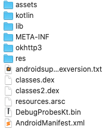
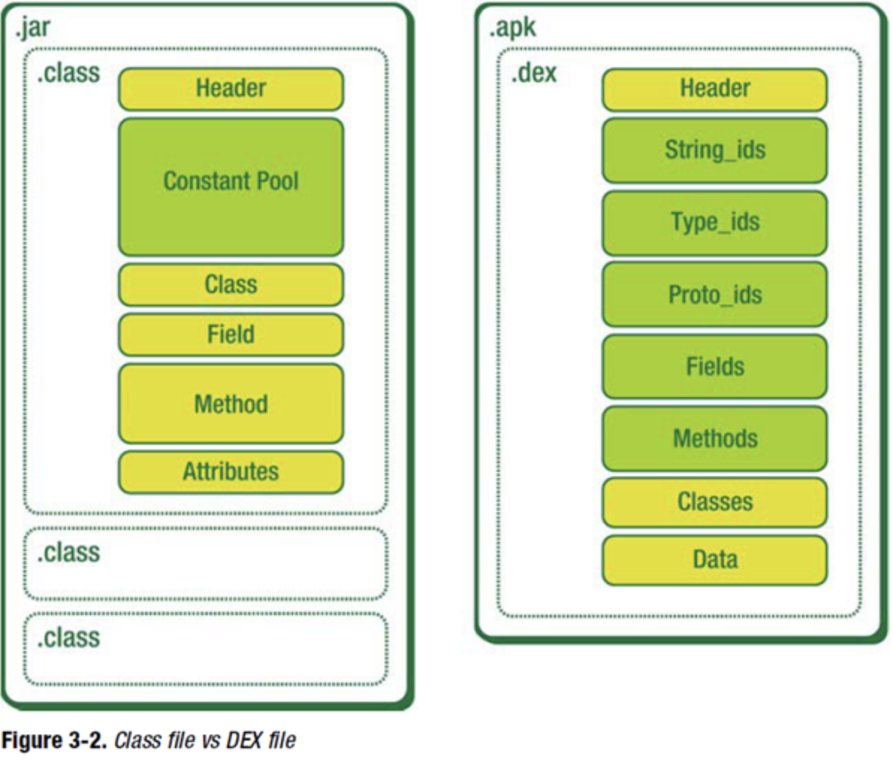
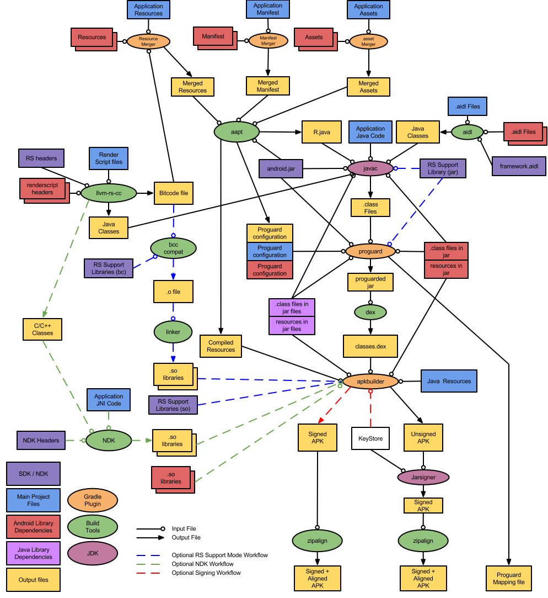
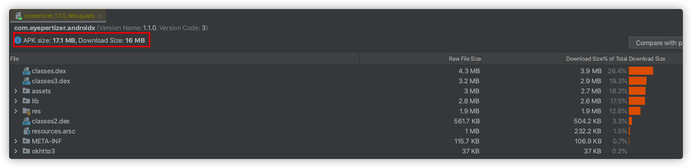
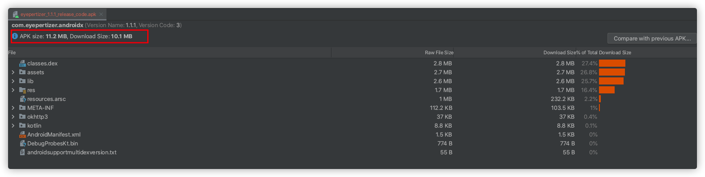
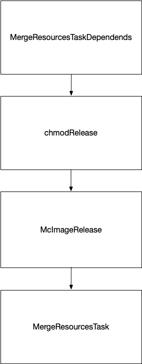

# Android 包体积优化

## 一、APK 分析
### 1、APK 组成



| 文件/目录           | 描述                                                         |
| ------------------- | ------------------------------------------------------------ |
| lib/                | 存放 so 文件                                                 |
| res/                | 存放编译后的资源文件                                         |
| assets/             | 应用程序的资源，可以使用 AssetManager 来检索该资源           |
| META-INF/           | 一般存放于已签名的 APK 中，它包含了 APK 中所有文件的签名摘要等信息 |
| classes(n).dex      | classes 文件是 Java Class，被 DEX 编译后可供 Dalvik/ART 虚拟机所理解的文件格式 |
| resources.arsc      | 编译后的二进制资源文件，资源索引表，记录资源文件和资源 ID 之间的隐射关系 |
| AndroidMenifest.xml | Android 的清单文件，格式为 AXML，用于描述应用程序的名称、版本、所需权限、注册的四大组件等 |

[https://tech.meituan.com/2017/04/07/android-shrink-overall-solution.html](https://tech.meituan.com/2017/04/07/android-shrink-overall-solution.html)

### 2、DEX 文件



[LEB128格式的说明](http://gttiankai.github.io/2016/06/30/leb128%E7%BC%96%E7%A0%81%E6%A0%BC%E5%BC%8F/)

[Dalvik 可执行文件格式](https://source.android.com/devices/tech/dalvik/dex-format.html)

[一篇文章带你搞懂DEX文件的结构](https://blog.csdn.net/sinat_18268881/article/details/55832757)

[Android逆向笔记 —— DEX 文件格式解析](https://juejin.cn/post/6844903847647772686)

[谈谈对Dex文件的认识](https://blog.csdn.net/li0978/article/details/114981769)

[Android 心得](https://blog.csdn.net/qiyu93422/category_3275641.html)

[图解Dex文件结构及解析要点](https://blog.csdn.net/beyond702/article/details/52460721)

### 3、Android 打包流程

1. **aapt 阶段**： `aapt` 工具(The Android Asset Packaing Tool) 编译 res 资源文件，把大部分 xml 文件编译成二进制文件(图片资源除外)，同事生成 R.java 和 resources.arsc 
2. **aidl 阶段**：处理 aidl 文件，生成对应的 Java 文件。
3. **JavaCampiler 阶段**：编译工程 `.java` 源代码（包括 R 文件和 AIDL 生成的 .java 文件），生成对应的 class 文件。
4. **dex 阶段**：转换所有的 class 文件，生成 classes.dex 文件。`dx` 工具，主要工作是将 Java 字节码转为为 Dalvik 字节码、压缩常量池、消除冗余信息等。
5. **apkBuild 阶段**：打包生成 APK 文件。打包工具为 `apkbuilder` ，resources.arsc + res + assets + so
6. **jarSigner 阶段**：对 APK 文件进行签名。
7. **zipAlign阶段**：对签名后的 APK 文件进行对齐处理。工具为 `zipalign` ，是 apk 包中的所有资源文件距离文件起始偏移为 4 字节整倍数，这样可以通过内存映射访问 apk 文件时速度会更快。




[10分钟了解Android项目构建流程](https://juejin.cn/post/6844903555795517453)

[Android APK文件结构 完整打包编译的流程 APK安装过程 详解](https://blog.csdn.net/aha_jasper/article/details/104944929)

[内存对齐的规则以及作用](http://www.cppblog.com/snailcong/archive/2009/03/16/76705.html)

## 二、代码瘦身方案

**Debug 包体积情况**：APK size：17.1 MB，Download Size：16 M，classes.dex：4.3 MB，res：1.9 MB，resources.arsc：1 MB




### 1、D8 & R8

[Android CPU, Compilers, D8 & R8](https://juejin.cn/post/6844903936227278861)

[Android对Java 8的支持](https://mp.weixin.qq.com/s/8MJBlvhaSQ6KOj1_6QhlGg)

[ Android 的 Java 9，10，11，12 的支持](https://juejin.cn/post/6973833926544457736)

- [ ] [jake wharton blog](https://jakewharton.com/blog/)

### 2、Dex 分包优化

- [ ] [Android字节码优化工具redex初探](https://mp.weixin.qq.com/s/Og2TkGrZR490h9-KO23lmw)
- [ ] [Redex](https://fbredex.com/docs/installation)
- [ ] [Optimizing Android bytecode with ReDex](https://engineering.fb.com/2015/10/01/android/optimizing-android-bytecode-with-redex/)
- [ ] [整体架构](http://yourbay.me/all-about-tech/2020/05/12/redex-1-arch/)
- [ ] [Dex解析](http://yourbay.me/all-about-tech/2020/05/13/redex-2-parse-dex/)

### 3、ByteX

#### 1. Java access

* access_inline
* const_inline
* field_assign_opt
* method_call_opt
* getter_setter_inline_plugin

#### 4、优化效果


**Release 代码优化包体积情况**：APK size：11.2 MB，Download Size：10.1 M，classes.dex：2.8 MB，res：1.7 MB，resources.arsc：1 MB，体积减少 **34.5%**。

### 三、资源瘦身方案

### 图片压缩



#### 使用 cwebp 将图片转换为 webp 格式

语法：

```
cwebp [options] -q quality input.png -o output.webp
```

[cwebp](https://developers.google.com/speed/webp/docs/cwebp)

```
cwebp -q 50 -lossless picture.png -o picture_lossless.webp
cwebp -q 70 picture_with_alpha.png -o picture_with_alpha.webp
cwebp -sns 70 -f 50 -size 60000 picture.png -o picture.webp
cwebp -o picture.webp -- ---picture.png
```

| 图片 | 原始大小 | 压缩大小 | 压缩率 |
| ---- | -------- | -------- | ---- |
| sun.png | 523917 | 10512 | 97.90% |
| circle.png | 326188 | 111828 | 65.64% |

#### 使用 guetzli、pngquant 压缩图片

```
guetzli [--quality Q] [--verbose] original.png output.jpg
guetzli [--quality Q] [--verbose] original.jpg output.jpg

pngquant --skip-if-larger --speed 1 --nofs --strip --force --output output.png -- origin.png
```

| 图片 | 原始大小 | quetzli | pngquant |
| ---- | -------- | -------- | ---- |
| sun.png | 523917 | * | 184909 |
| circle.png | 326188 | * | 85971 |
| circle.jpg | 265267 | 81595 | * |

