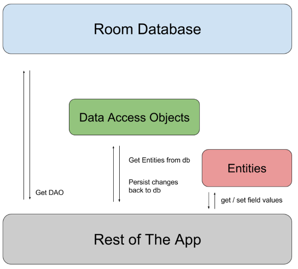

# ROOM

### 优势

* 对查询进行编译时验证
* 减少模板代码
* 易于理解和使用
* 与RxJava、LiveData和Kotlin Coroutines轻松集成

### ROOM 组成部分

* **Database**：包含数据库持有者，并作为底层连接到应用程序持久化、关系型数据的主要访问点。
* **Entity**：代表数据库中的一个表。
* **DAO**：包含用于访问数据库的方法



### Database

* 继承 RoomDatabase 的抽象类
* 注解中包括与数据库相关实例的 entities 列表
* 包含一个抽象方法，该方法没有参数，并返回带有 `@Dao` 注释的类
* 可以调用 `Room.databaseBuilder()` 或 `Room.inMemoryDatabaseBuilder()` 来获得一个 Database 实例

```kotlin
@Database(entities = [SearchHistory::class], version = 1)
abstract class SearchDatabase : RoomDatabase() {

    abstract fun searchDao(): SearchDao
}
```

### Entity

一个实体代表数据库中的一个表。这个类用 @Entity 注解。该类中的数据成员代表表内的列。

```kotlin
@Entity
data class SearchHistory(
    @PrimaryKey val id: Int,
    @ColumnInfo(name = "value") val value: String
)
```

* Entity 的所有字段都必须是 public 的或者有 getter 和 setter 方法
* Entity 类应该有一个空的构造方法或一个带有所有字段的参数化构造函数，Room 也可以使用部分的构造函数
* 每个实例必须只是有一个主键，可以使用 `@PrimaryKey` 注释来定义单个字段的主键，或者使用 `primaryKeys` 属性定义多个字段

```kotlin
@Entity(primaryKeys = arrayOf("id", "value"))
```

* 默认情况下，Room 使用类的名称作为数据库的表。`@Entity` 注解的 `tableName` 可以定义表的名字，`@ColumnInfo` 注解的 `name` 属性定义列的名称。

```kotlin
@Entity(tableName = "users")
```

* 如果不想持久化某些字段，可以使用 @Ignore 注解

```kotlin
@Ignore val picture: Bitmap?
```

* 可以使用 `@Entity` 注解的 `indices` 属性来为实体添加索引。另外，可以通过将`@Index` 注解的 `unique` 属性设置为 `true` 来创建唯一的索引。

```kotlin
@Entity(indices = arrayOf(Index(value = ["last_name", "address"])))@Entity(indices = arrayOf(Index(value = ["first_name", "last_name"], unique = true)))
```

### Data Access Object (DAO)

DAO 提供了一个访问数据库的 API。这是一个被 @Dao 注解的接口。这个接口中的所有方法都用于从数据库中获取数据或对数据库进行修改。这些方法被注解为 @Query,  @Insert, @Delete。

```kotlin
@Dao
interface SearchDao {

    @Query("SELECT * FROM search_history")
    fun getAll(): List<SearchHistory>

    @Query("SELECT * FROM search_history WHERE id IN (:searchIds)")
    fun loadAllByIds(searchIds: IntArray): List<SearchHistory>

    @Insert
    fun insertAll(vararg searches: SearchHistory)

    @Delete
    fun delete(search: SearchHistory)
}
```


### TANKS

[Introduction to Room Persistent Library in Android](https://blog.mindorks.com/introduction-to-room-persistent-library-in-android)

[Data Access Objects - DAO in Room](https://blog.mindorks.com/data-access-objects-dao-in-room)


